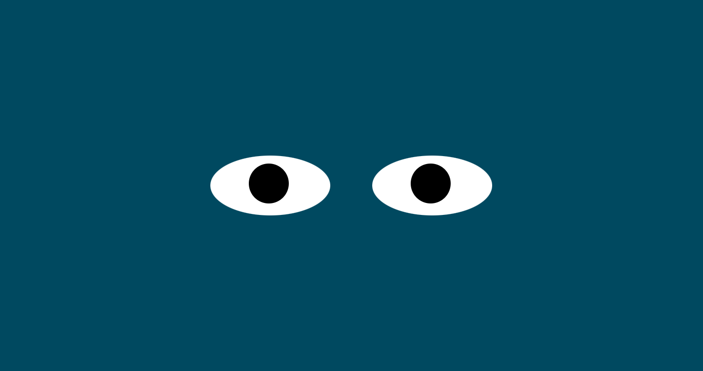

# EyeMovement-Exercise
Eye Movement for Github Portfolio Project.

**Project Title:** Eye Movement Exercise

**Project Description:** Interactive Eye Movement exercise. Move your mouse around to make the eye follow your cursor around the screen. This is an interactive experience. 

**How To Run:** To run the Eye Movement Exercise. Simply Move your cursos around the screen and look at how the eye won’t stop following you to see what you do.

**RoadMap To Future Improvements:**  In the future I would like  make the eye prettier, by adding some eyelashes and maybe a smily face. Also I would like to add a blinking movement every couple seconds to make it more realistic and fun.

**License** MIT License. 
Copyright <2023> <Natalia Loria>

Permission is hereby granted, free of charge, to any person obtaining a copy of this software and associated documentation files (the “Software”), to deal in the Software without restriction, including without limitation the rights to use, copy, modify, merge, publish, distribute, sublicense, and/or sell copies of the Software, and to permit persons to whom the Software is furnished to do so, subject to the following conditions:

The above copyright notice and this permission notice shall be included in all copies or substantial portions of the Software.

THE SOFTWARE IS PROVIDED “AS IS”, WITHOUT WARRANTY OF ANY KIND, EXPRESS OR IMPLIED, INCLUDING BUT NOT LIMITED TO THE WARRANTIES OF MERCHANTABILITY, FITNESS FOR A PARTICULAR PURPOSE AND NONINFRINGEMENT. IN NO EVENT SHALL THE AUTHORS OR COPYRIGHT HOLDERS BE LIABLE FOR ANY CLAIM, DAMAGES OR OTHER LIABILITY, WHETHER IN AN ACTION OF CONTRACT, TORT OR OTHERWISE, ARISING FROM, OUT OF OR IN CONNECTION WITH THE SOFTWARE OR THE USE OR OTHER DEALINGS IN THE SOFTWARE.

